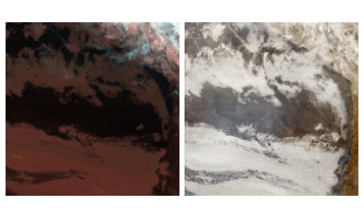

# Climate Informatics 2020 Data Challenge

_In the context of the [Climate Informatics 2020 conference](https://ci2020.web.ox.ac.uk/home) data challenge, we attempt to predict visible imagery at night using thermal infra-red observation. More details on the challenge and datasets in [here](https://competitions.codalab.org/competitions/26644). In this work, we propose to train a [pix2pix](https://phillipi.github.io/pix2pix/)-like cGANs at spectral domain translation._

## Getting started

__From command line__

Setup a configuration file specifying experiment hyperparameters, templates provided [here](https://github.com/shahineb/ci-hackathon/tree/master/config).

Then run

```
$ python run_training.py --cfg=path_to_config_file --o=path_to_logs_directory --device=gpu_id
```

To reproduce the experiment submitted to the hackathon, one should use configurations specfied by `config/base_unet.yaml`

__From a notebook__

See [demonstration notebook](https://github.com/shahineb/ci-hackathon/blob/master/notebooks/demo.ipynb) on how to run an experiment.

__Results__

<p align="center">
  
  <em> Example of predicted visible images from nightly infrared inputs </em>
</p>


## Installation

Code implemented in Python 3.8

#### Setting up environment

Clone and go to repository
```bash
$ git clone https://github.com/shahineb/ci-hackathon.git
$ cd ci-hackathon
```

Create and activate environment
```bash
$ pyenv virtualenv 3.8.2 hackathon
$ pyenv activate hackathon
$ (hackathon)
```

Install dependencies
```bash
$ (hackathon) pip install -r requirements.txt
```
